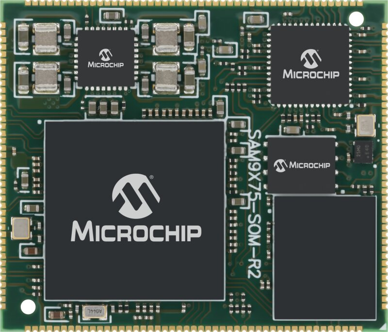

# SAM9X75 System-On-Modules Series
## Early Access Repository

The SAM9X75 System-On-Module (SOM) series is a single-sided solderable SOM based on the SAM9X75 ARM926EJ-S CPU running up to 800MHz.  
The SAM9X75 SOM series is based on a SAM9X75 System-in-Package (SIP) with up to 2Gb DDR3L SDRAM and up to 4-Gbit NAND Flash memory, a Gigabit Ethernet PHY, a 64-Mbit serial Quad I/O Flash memory and a dedicated Power Management IC.   
This new SOM series is targeted for production very soon, but in the meantime this Github repository serves as the main resource for documentation and software support for the SAM9X75 SOM series.

For more information about the SAM9X75 MPU, or the associated SIPs and SOM referenced above, please visit the respective product page on Microchip.com:
* SoC
  * https://www.microchip.com/en-us/product/SAM9X75
* SiP
  * https://www.microchip.com/en-us/product/SAM9X75D1G
  * https://www.microchip.com/en-us/product/SAM9X75D2G
* SOM
  * https://www.microchip.com/en-us/product/SAM9X75D2GN4

## Collaterals
* Please visit the official SAM9X75D2GN4 SOM product page:
  * https://www.microchip.com/en-us/product/SAM9X75D2GN4
  
